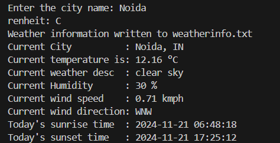
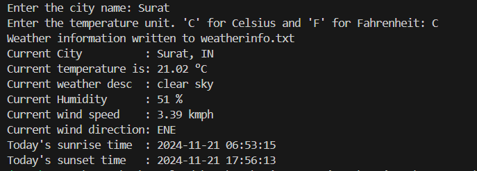

# WeatherTeller
WeatherTeller
A Python project that provides weather reports using APIs.

## Features
- Retrieves current weather data.
- User-friendly CLI interface.
- Utilizes OpenWeatherMap API.

## Requirements
- Python 3.x
- `requests` library

## Usage
1. Clone the repository:
   ```bash
   git clone https://github.com/viveknair6915/WeatherTeller.git

2. Navigate to the folder:
```bash
cd WeatherTeller
```
3. Create a .env file in the project directory with the following content:
```bash
API_KEY=your_openweathermap_api_key_here
```

4. Run the project:
```bash
python weather.py
```
5. Output:




